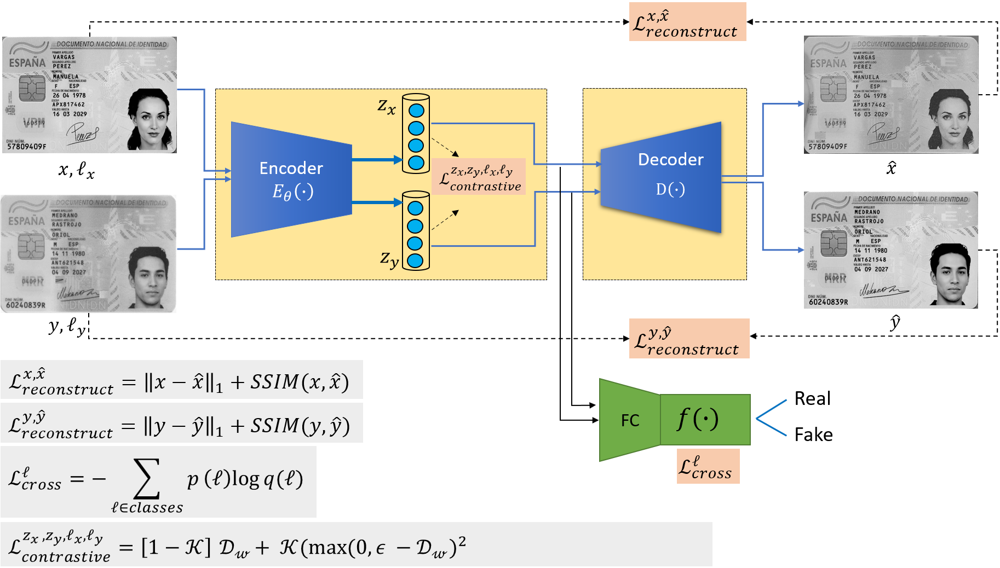
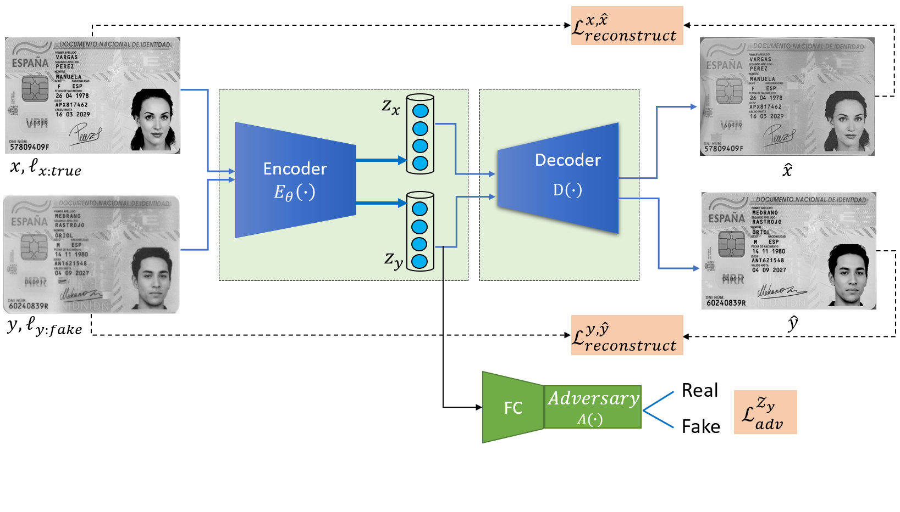

# ID_fraud_detection
## Introduction   
In this paper, we propose two anomaly detection models for
identity documents verification, comprising contrastive and adversarial learning frameworks.
The first proposed model learns the representations in a con-
trastive learning manner, named as contrastive based fraud de-
tection model (ContFD), and the second model learns the rep-
resentations based on an adversarial setting, which is named as
constrained-adversary based fraud detection model (AdvFD).
Both models work to well classify authentic (real) and forged
(fake) identity documents.

## Contents   
1- Contrastive based fraud detection model (ContFD).  
This model employs an encoder-decoder-classifier sub-networks which enable the model to map the input image into a lower-dimension feature vector, and then to reconstruct the output image. The objective of classifier is to well classify the input image into a real or fake image. 

   
2- Constrained-adversary based fraud detection model (AdvFD).  
This model is similar to the ContFD model, the ony difference is that the classifier network f(.) is replaced by a onstrained-adversarial model A(.).

   

## Installation  

pip install -r requirements.txt

git clone https://github.com/malghadi/ID_fraud_detection.git

--# install pytorch, torchvision refer to https://pytorch.org/get-started/locally/  
 
pip install torch==1.13.0+cu116 torchvision==0.14.0+cu116 -f https://download.pytorch.org/whl/torch_stable.html

## Pre-trained Models  

## Description   

## Citation  

## Acknowledgement  

## Contact   
